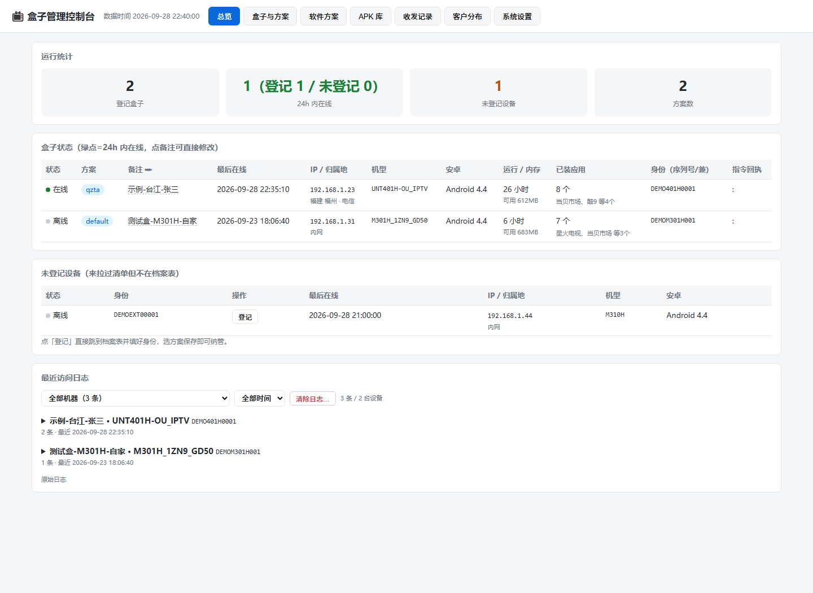
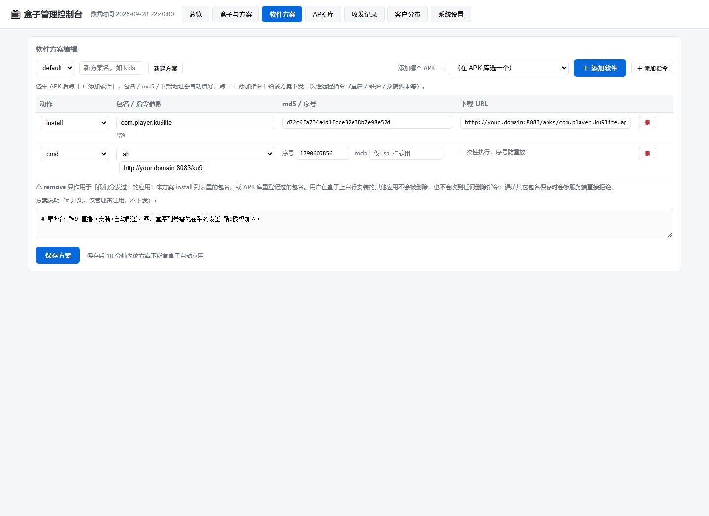
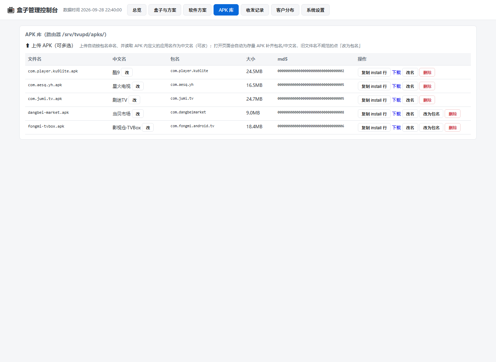
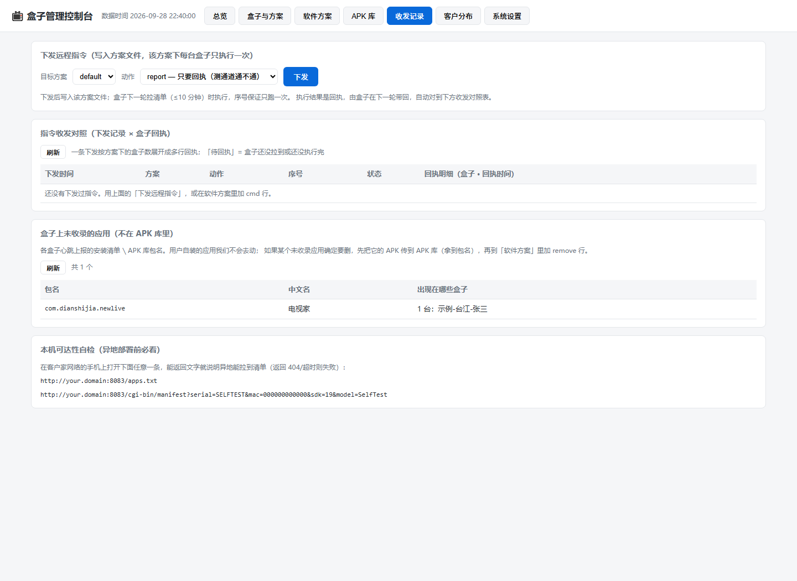
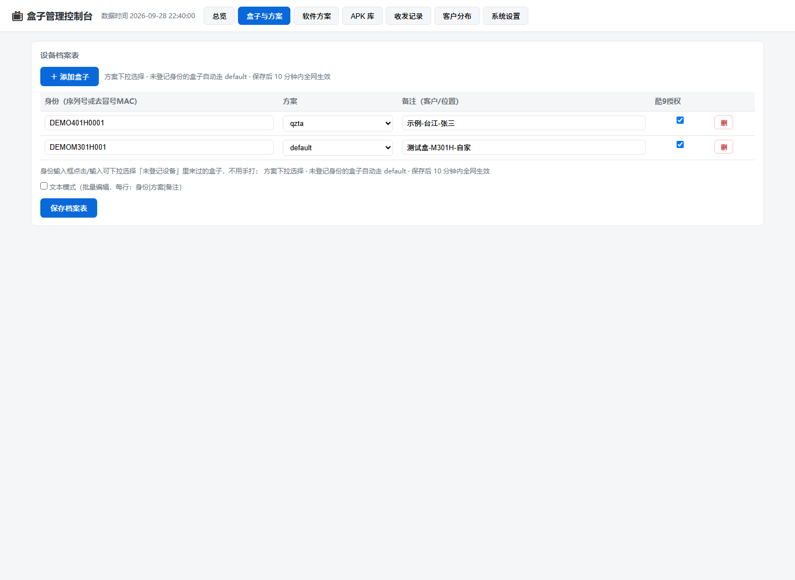
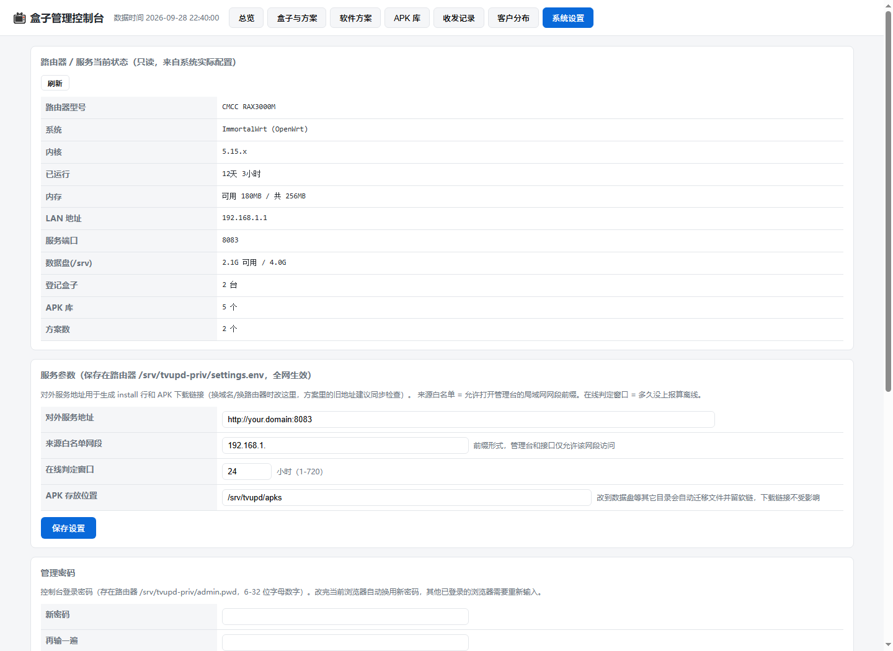

# tvupd-server —— 电视盒子远程自维护分发系统（OpenWrt 服务端）

**中文** | [English](README.en.md)

给一批安卓电视盒子（IPTV 定制机）做**远程集中管理**的服务端，跑在 OpenWrt 路由器上：
自动登记、静默安装/卸载应用、远程指令（重启/清缓存/救砖脚本…）、客户归属地分布、APK 分发库，
自带 Web 管理控制台和 LuCI 菜单入口。配套的盒子端植入方案见文末。

## 功能一览

| 模块 | 说明 |
|---|---|
| 盒子自动登记 | 盒子定时拉清单即完成上报（序列号/MAC/机型/安卓版本/内存/已装应用/运行时长），按 MAC 归并重复身份 |
| 软件方案 | install / remove / cmd 三类行；**remove 只能删我们分发过的应用**（服务端强制白名单，保护客户自装应用） |
| 远程指令 | report / reboot / memclean / clearcache / dns / wifi / oem / maint / status / sh（脚本 URL + md5 校验），nonce 防重放、只执行一次 |
| 收发记录 | 下发记录 ⨯ 盒子回执自动配对成对照表；「未收录应用」视图发现想删但库里没有的应用 |
| APK 库 | 上传 APK 自动识别包名（浏览器端解析 AndroidManifest），支持中文名 |
| 客户分布 | 出口 IP 归属地 + 运营商（ip-api.com 中文接口，本地缓存），客户优先排列 |
| 系统设置 | 对外服务地址 / 管理白名单网段 / 在线判定窗口 / **APK 存放位置（改动自动迁移+软链）** / 管理密码，默认值自动取路由器当前配置 |
| 免刷机 agent | `agent/`：TV管家 APK，用户级安装即可接入（无 root 时安装应用需按一次确认），协议与固件端完全一致 |

## 界面截图（脱敏演示数据）

序列号均为 DEMO 前缀的虚构值，IP 用 192.168.1.x，域名为 your.domain。

| 总览 | 软件方案 |
|---|---|
|  |  |
| **APK 库** | **收发记录** |
|  |  |
| **设备档案** | **系统设置（含酷9授权名单）** |
|  |  |

实机效果：方案下发 → 酷9 自动安装 + 按序列号授权 → 预置订阅自动加载，开机即播（下图为客户实拍频道画面）：


## 实测环境

**主路由 / 服务器**

| 项目 | 配置 |
|---|---|
| 路由器 | 中移 CMCC RAX3000M（MT7981，256MB 内存） |
| 系统 | ImmortalWrt（OpenWrt）+ lighttpd/CGI |
| 对外服务 | DDNS 域名 :8083，仅暴露 manifest 与 APK 下载；管理台仅内网白名单可开 |
| 存储 | 路由器本体 /srv（APK 库可迁数据盘，自动软链） |
| 网络 | 家用宽带，客户盒子经 DDNS 域名回连拉方案 |

**盒子端（两款真机实测）**

| 机型 | 接入方式 | 实测内容 |
|---|---|---|
| UNT401H（中国移动 IPTV 定制机，Android 4.4） | 固件植入（tv-updater 写入 /system） | 酷9 自动装机 + 序列号授权 + 预置订阅自动加载，开机即播，全程零人工；远程指令/APK 分发正常 |
| M301H（中国移动魔百和，Android 4.4） | 固件植入（同上） | 心跳上报 / 方案下发 / 远程指令 / APK 分发长期运行 |

两款均为 Android 4.4（SDK 19），验证了全链路兼容老固件：清单轮询、静默安装、脚本下发（busybox wget + DNS 兼容层）、以及酷9 的 `/sdcard/酷9/configuration/` 预置订阅机制。

## 目录结构

```
tvupd-server/
├── install.sh        # OpenWrt 一键安装（自动探测网段、装依赖、生成 lighttpd 配置）
├── uninstall.sh      # 卸载（默认保留数据，PURGE=1 连数据删）
├── backup.sh         # 打包全部业务数据 → tar.gz
├── restore.sh        # 在新路由器上导入备份包
├── www/              # lighttpd 站点（document-root = /srv/tvupd）
│   ├── admin         # 管理 CGI（dashboard/方案/设置/密码/路由器信息…）
│   ├── manifest      # 盒子端 CGI（上报 + 下发方案）
│   ├── admin.html    # 管理控制台前端（单文件，无外部依赖）
│   ├── apps.txt      # 对外自检文件
│   └── fixadb.sh     # 盒子端网络 adb 修复小脚本
├── priv-skel/        # 首次安装的数据骨架（不覆盖已有数据）
│   ├── devices.txt   # 设备档案表（身份|方案|备注）
│   ├── geo-lookup.sh # 归属地查询（ip-api.com，结果缓存）
│   └── plans/        # 示例方案 default/family/senior/lab
├── box/              # 盒子端（Android 4.x IPTV 定制机）
│   ├── install-to-box.sh  # adb 一键装入 /system（路线 A：临时安装）
│   ├── system/            # tv-updater / tv-maint / tv-oemctl / 开机自启 / 配置
│   ├── firmware/          # 固件植入参考（boot.img 重打包、filesystem_config 登记）
│   └── README.md          # 两条接入路线 + OTA 签名要点
└── luci/admin.js     # LuCI 菜单视图（iframe 内嵌控制台）
```

## 安装（OpenWrt）

```sh
# 在路由器上（或先 scp 本目录到路由器）
opkg update && opkg install git git-http   # 或直接在电脑上 clone 后 scp
sh install.sh
# 可选参数：
#   PORT=8090                  换端口（默认 8083）
#   SRVURL=http://xxx:8083     对外地址（DDNS 域名），默认自动用 LAN IP
#   ADMIN_PWD=xxx              指定管理密码（默认随机生成并打印）
#   SRCNET=192.168.9.          管理白名单网段（默认从 LAN IP 自动推导）
```

装完会打印控制台地址和管理密码。LuCI → 服务 → TV盒子运维控制台 也有入口（iframe 内嵌）。

## 迁移到另一台 OpenWrt

```sh
# 旧路由器
sh backup.sh                     # 生成 tvupd-backup-日期.tar.gz
scp tvupd-backup-*.tar.gz root@新路由器:/tmp/

# 新路由器
sh install.sh                    # 先装好服务
sh restore.sh /tmp/tvupd-backup-*.tar.gz
# 最后在控制台「系统设置」把对外服务地址改成新地址
```

## 盒子端怎么接

两种方式（详见 `box/README.md`）：

- **路线 A · 临时安装**：盒子 root + 网络调试后，`sh box/install-to-box.sh <盒子IP>` 一键装入 /system
- **路线 B · 固件植入**：把 `box/system/` 打进刷机包，批量出货开机即带，零逐台调试

盒子只要能访问 `http://<服务地址>/cgi-bin/manifest?id=<身份>&mac=&sdk=&model=&group=&up=&mem=&tn=&ta=&cmd=<回执>`
即可入网：首次拉取返回 default 方案，在档案表登记后自动切换方案（≤10 分钟生效）。

## Credits

由 darst335 与 AI 共同创造 🤝

## 安全说明

- 管理接口：内网白名单网段 + 令牌（`/srv/tvupd-priv/admin.pwd`，6-32 位字母数字），令牌走 `X-Auth-Token` 头不进日志
- 盒子接口：manifest 只读方案 + 上报，不改任何配置
- 外网访问 admin 一律 403（lighttpd 层拦截）；对外仅暴露 manifest 与 APK 下载
- 数据目录 `/srv/tvupd-priv` 权限 600/700，备份包内含管理密码，注意保管

## 数据文件说明（/srv/tvupd-priv）

| 文件 | 内容 |
|---|---|
| devices.txt | 设备档案表：`身份|方案|备注`（# 开头为注释） |
| plans/*.txt | 方案：`install|包名|md5|URL`、`remove|包名`、`cmd|序号|动作|参数|md5` |
| access.log | 盒子心跳：`时间|序列号|MAC|IP|SDK|机型|方案|备注|运行h|可用内存|应用数|应用清单` |
| cmds.log | 指令回执：`时间|序列号|<nonce><动作><结果>` |
| audit.log | 管理操作审计 |
| settings.env | 系统设置（SRVURL/SRCNET/ONLINE_H） |
| ipcache/ | 公网 IP 归属地缓存（两行：归属地 / 运营商） |
